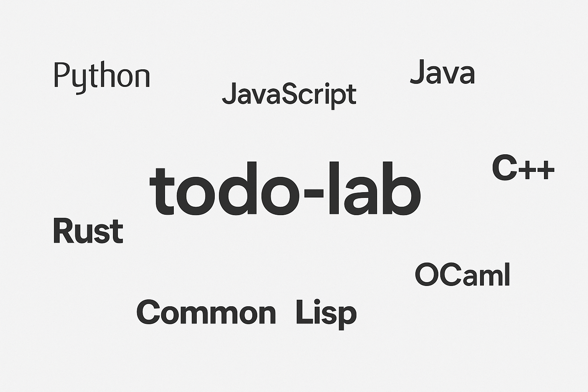

A personal learning lab where I implement a simple command-line TODO app in multiple programming languages.

This project isn't about building a full-featured application. Instead, it's an intentional constraint: one small idea, many implementations. I want to explore how different languages express the same logic, how they handle input, manage state, and structure code.

# What is the app?

Each version supports the same set of basic features:

- Add a task
- List all tasks
- Remove a task by number
- Exit the program

There’s no file storage - everything lives in memory during a single run.

See the full [App Specification](./SPEC.md) for expected behavior.

### Why this matters

Even a simple app like this exercises several core language features:

- **Input parsing** (reading user choices and strings)
- **Control flow** (menus, loops, matching commands)
- **Data structures** (managing a list of tasks)
- **Printing and formatting** (user-friendly output)
- **Mutability or immutability** (depending on the paradigm)

## Languages

- Python
- JavaScript
- Rust
- Go
- Java
- C
- C++
- OCaml
- Common Lisp

## Notes by Language

### Python

> A familiar and expressive starting point. Prioritizing clarity and minimalism.

### JavaScript

> Quick to prototype. Avoiding browser-specific code and keeping things simple.

### Rust

> Exploring memory safety and ergonomics in a small CLI app. Curious how verbose it’ll get.

### Go

> A clean standard library and strong CLI support. Should be very straightforward.

### Java

> Verbose for a tiny task, but a good reminder of structured OOP workflows.

### C

> The most manual approach - a chance to revisit low-level memory and input handling.

### C++

> Slightly higher-level than C. Will try a clean, modern style, not just “C with classes.”

### OCaml

> Great pattern matching and functional purity. A nice change from imperative flow.

### Common Lisp

> Dynamic, flexible, and interactive. Will lean into the REPL and keep things fluid.

---

This is primarily a personal project, but if you’re reading this and feel inspired to try something similar - go for it.
