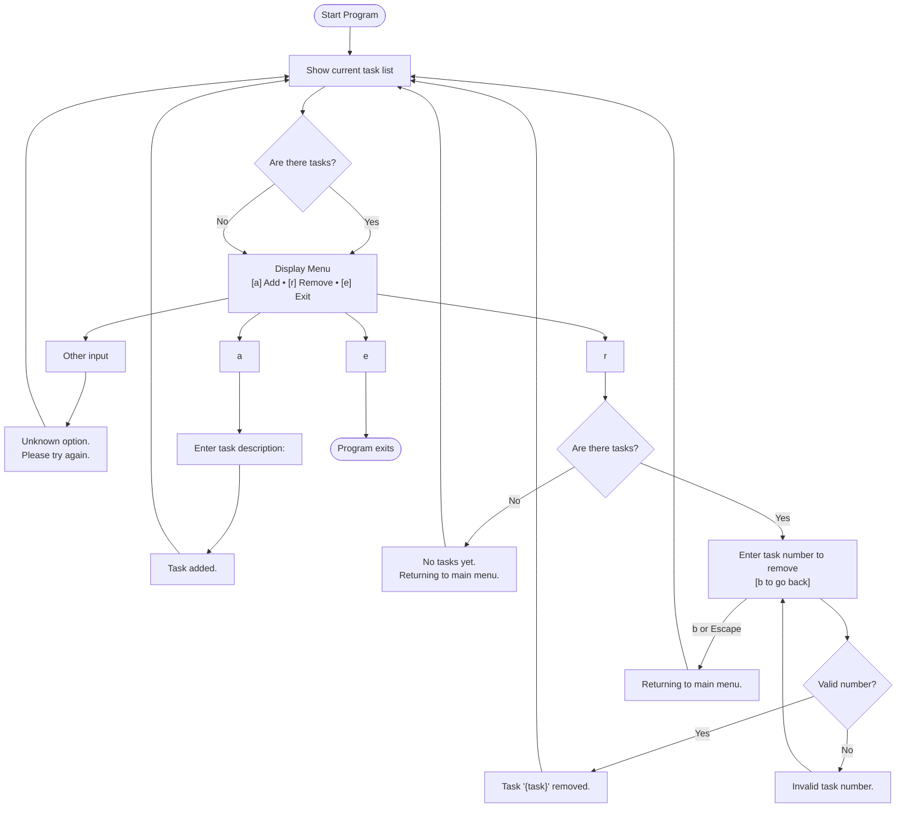

# App Specification

This document defines the expected behavior of each implementation in the `todo-lab` project. It ensures consistency across languages while allowing for idiomatic expression.

---

## Interface Overview

When the program starts, it displays:

1. The **current list of tasks**, numbered from 1.
2. A **menu of options**:

```
\[a] Add task
\[r] Remove a task
\[e] Exit
```

If there are no tasks, display:

```
No tasks yet.
```

Then show the menu.

---

## User Interaction

If the user enters an **unrecognized command**, display:

```
Unknown option. Please try again.
```

Then re-display the task list and menu.

---

## Command Behavior

### [a] Add Task

- Prompt:

```
Enter task description:
```

- After the user enters a line of text:
- Add it to the task list.
- Display:
  ```
  Task added.
  ```
- Then show the updated task list and menu.

### [r] Remove Task

- **Prompt immediately**:

```
Enter task number to remove \[b to go back]:
```

- **User input handling**:
- **Valid task number**:

  - Remove the task.
  - Show:
    ```
    Task "{task-name}" removed.
    ```
  - Then show the updated task list and menu.

- **Invalid input** (non-number or out-of-range):

  ```
  Invalid task number.
  ```

  Then prompt again.

- **`b` or Escape key**:

  ```
  Returning to main menu.
  ```

  Then show the current task list and menu.

- **If no tasks exist** before entering removal:

```
No tasks yet.
Returning to main menu.
```

Then show the menu.

### [e] Exit

- The program terminates cleanly.

## Flowchart


